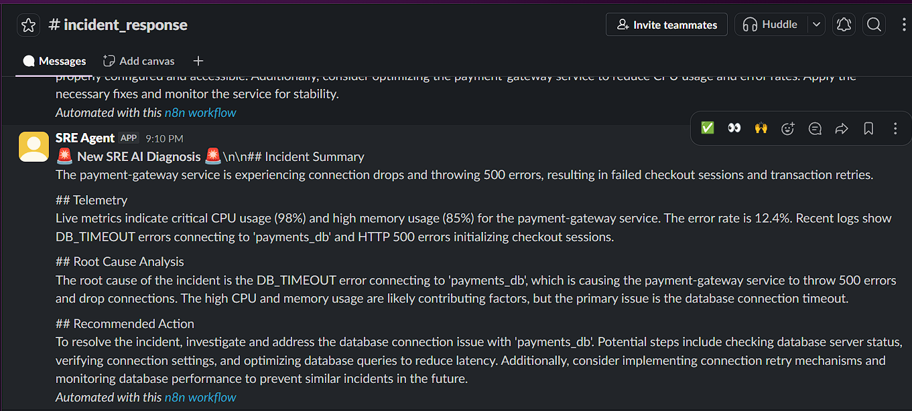
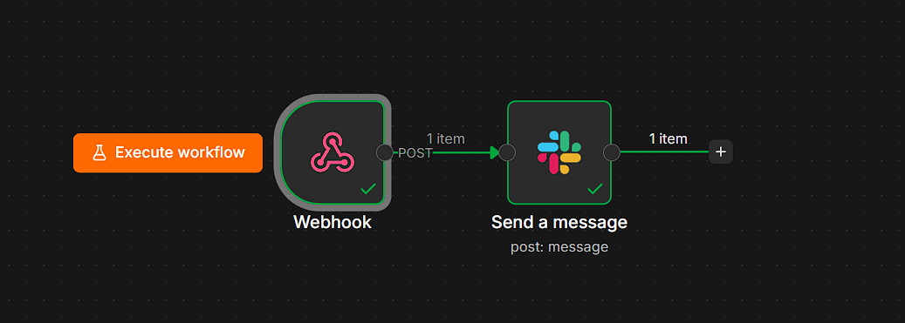
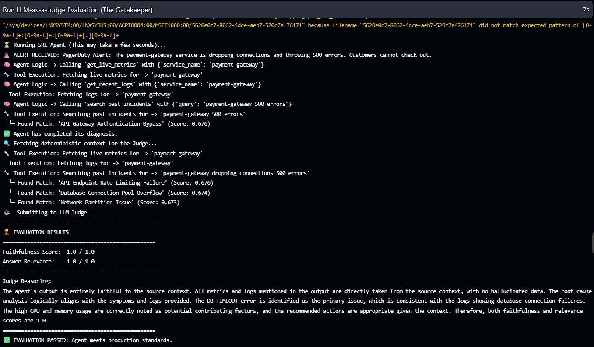
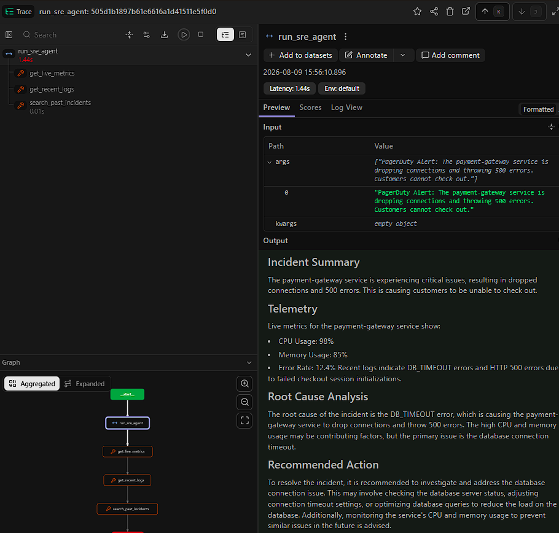

# Automated SRE Incident Responder

An AI-driven, microservice-based Site Reliability Engineering (SRE) agent designed to autonomously analyze incoming system alerts and recommend immediate root-cause resolutions. 

This project is built using an Agentic RAG architecture and enforces strict structured outputs (JSON) to seamlessly integrate into automated DevOps and incident management pipelines.

## 🚀 End-to-End Execution
*When an alert fires, the agent asynchronously diagnoses the issue and delivers the RCA directly to Slack within seconds.*



---

## Tech Stack
* **Framework:** FastAPI (Python)
* **AI Engine:** Groq API (`llama-3.1-8b-instant`) for ultra-low latency inference
* **Data Validation:** Pydantic (Strict JSON enforcement)
* **Observability:** Langfuse (Execution tracing, latency tracking, and prompt monitoring)
* **Infrastructure:** Docker (Sandboxed containerization)

## Security & Architecture highlights
* **Principle of Least Privilege:** The application runs as a dedicated, non-root user (`sre_agent`) inside the Docker container to prevent host-system compromise in the event of an LLM prompt injection attack.
* **12-Factor App Methodology:** Environment-agnostic codebase utilizing dedicated `.env.dev` files to strictly separate development and production API keys.
* **Modular Design:** Separation of concerns across API routing, LLM service logic, and prompt templating.

### System Architecture & Workflow
*Event-driven orchestration using n8n to route webhooks, securely authenticate payloads, and deliver the final diagnosis to external platforms.*



## Automated Evaluations & CI/CD
*Automated GitHub Actions pipeline utilizing GPT-4o as a judge to grade the agent on Faithfulness. The build automatically hits `exit(1)` and fails if the agent hallucinates or violates the evidence hierarchy.*

**GitHub Actions Pipeline:**


**GPT-4o Judge Console Output:**


## 📊 Observability & Telemetry (LLMOps)
*Langfuse trace graph detailing the agent's execution path, specific tool call arguments (e.g., live metrics, vector DB search), and ultra-low latency token generation.*



---

## 🛠️ Local Setup & Deployment

### 1. Environment Variables
Create a `.env.dev` file in the root directory and add your API keys:
```env
GROQ_API_KEY=your_groq_key
AGENT_MODEL_NAME=llama-3.3-70b-versatile
LANGFUSE_SECRET_KEY=your_langfuse_secret
LANGFUSE_PUBLIC_KEY=your_langfuse_public
LANGFUSE_BASE_URL=[https://cloud.langfuse.com](https://cloud.langfuse.com)
LANGFUSE_HOST=[https://cloud.langfuse.com](https://cloud.langfuse.com)
OPENAI_API_KEY=your_openai_key
JUDGE_MODEL_NAME=gpt-4o
N8N_WEBHOOK_TOKEN=your_secure_webhook_token
